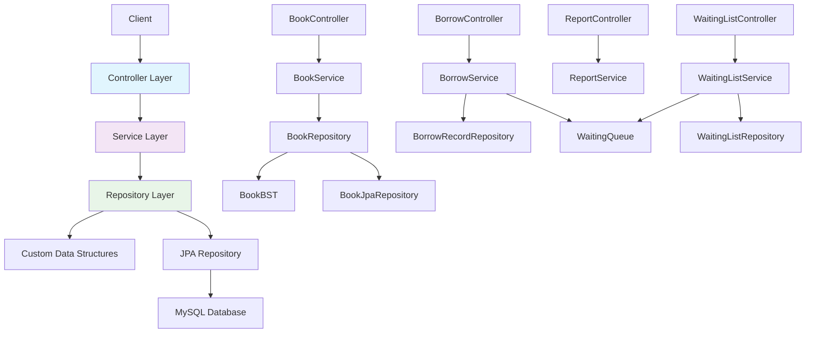
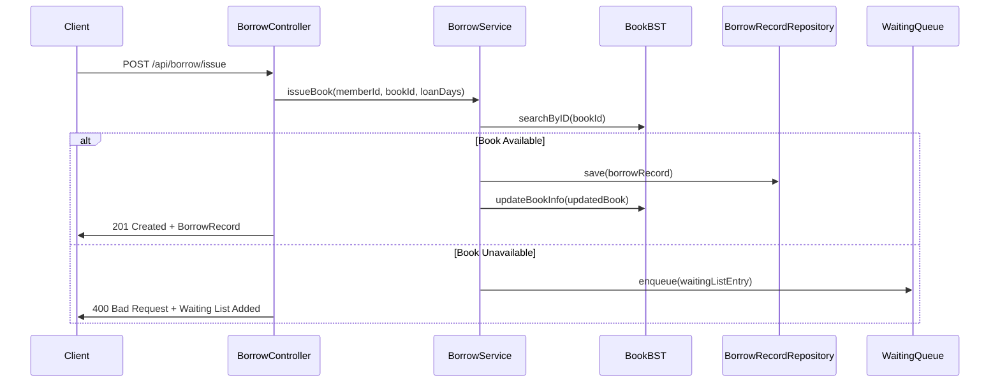

# Library Management System

[](https://www.oracle.com/java/)
[](https://spring.io/projects/spring-boot)
[](LICENSE)
[](https://maven.apache.org/)

Educational CSE111 Data Structures project demonstrating a hybrid persistence approach (custom in-memory data structures + JPA persistence) implemented with Spring Boot, Thymeleaf and MySQL.

---

## Table of Contents

- [Project Overview](#project-overview)
- [Features](#features)
- [Technology Stack](#technology-stack)
- [Architecture](#architecture)
- [Custom Data Structures](#custom-data-structures)
- [Project Structure](#project-structure)
- [Database Schema](#database-schema)
- [Prerequisites](#prerequisites)
- [Installation & Setup](#installation--setup)
- [Docker Deployment](#docker-deployment)
- [API Documentation](#api-documentation)
- [Frontend Pages](#frontend-pages)
- [Implementation Status](#implementation-status)
- [Troubleshooting & Common Issues](#troubleshooting--common-issues)
- [Future Enhancements](#future-enhancements)
- [Contributing](#contributing)
- [License](#license)
- [Authors](#authors)
- [Acknowledgments](#acknowledgments)

---

## Project Overview

The Library Management System is a learning project for the CSE111 Data Structures course. It combines Spring Boot web application patterns with custom implementations of common data structures (Binary Search Trees, Queues, Linked Lists) to manage books, members, and related library operations. The project demonstrates how custom in-memory structures can be used alongside a relational database (MySQL) to provide efficient queries and persistence.

Key learning objectives:

- Implement and use Binary Search Trees (BST) for efficient lookups.
- Integrate custom data structures with Spring Data JPA for persistence.
- Design a layered MVC application with services and repositories.

---

## Features

- **Book Management:** Add, update, delete, search books. Books are stored in an in-memory `BookBST` for fast lookups and persisted to MySQL via JPA.
- **Member Management:** Register, update, and list members using `MemberBST`.
- **Borrowing Workflow:** Complete book borrowing system with loan tracking, return processing, and renewal capabilities. Includes issue books, return books, and renew borrowed books.
- **Waiting List Queue:** FIFO-based reservation system for unavailable books. Members can join waiting lists and are automatically notified when books become available.
- **Reports & Analytics:** Generate overdue book reports, most-borrowed books analysis, and member activity tracking with flexible date filtering and limits.
- **Billing & Fines:** Basic billing endpoints and fine calculation (partially implemented).
- **Dashboard & UI:** Thymeleaf templates provide a web UI for day-to-day operations.

---

## Technology Stack

- Backend: Java 17, Spring Boot 4.0, Spring MVC, Spring Data JPA
- Frontend: Thymeleaf templates, HTML5, CSS3, JavaScript
- Database: MySQL 8.0 (development); HSQLDB may be used for tests
- Build: Maven (wrapper `mvnw` included)
- Containerization: Docker

---

## Architecture

The application follows an MVC pattern:

- Controller → Service → Repository → Data Structures / JPA

This project uses a hybrid persistence strategy:

- MySQL (via Spring Data JPA) is the source of truth for persisted data.
- Custom in-memory data structures (BST) are populated at startup from the DB and kept synchronized on writes.

This approach allows fast in-memory reads (O(log n) average for BST) while persisting data for durability.



### Borrowing Workflow Sequence



---

## Custom Data Structures

- **BookBST** (`src/main/java/com/aiu/library/datastructures/BookBST.java`)
	- Binary Search Tree keyed by `bookID`.
	- Operations: insert, delete, searchByID, searchByTitle, in-order traversal, findMaxId.

- **MemberBST** (`src/main/java/com/aiu/library/datastructures/MemberBST.java`)
	- Binary Search Tree keyed by `memberId` for member operations.
 
 - **BorrowRecordList** (planned stub)
	 - Path: `src/main/java/com/aiu/library/datastructures/BorrowRecordList.java`
	 - Intended type: Doubly-linked list for borrow history records
	 - Core operations: `append(record)`, `remove(record)`, `iterateForward()`, `iterateBackward()`

 - **WaitingQueue** (`src/main/java/com/aiu/library/datastructures/WaitingQueue.java`)
	 - Implemented FIFO queue for reservations with thread-safe operations
	 - Core operations: `enqueue()`, `dequeue()`, `peek()`, `size()`, `removeById()`, `removeAllByMemberId()`, `findByBookId()`
	 - Uses `ReadWriteLock` for concurrent access control

 - **BillingList** (planned stub)
	 - Path: `src/main/java/com/aiu/library/datastructures/BillingList.java`
	 - Intended type: Singly or doubly linked list to maintain payment history per member
	 - Core operations: `addPayment(payment)`, `getPayments(memberId)`, `remove(paymentId)`

### Complexity Analysis

| Operation | BookBST Average | BookBST Worst | WaitingQueue Average | WaitingQueue Worst |
|-----------|-----------------|---------------|---------------------|-------------------|
| `addBook()` | O(log n) | O(n) | O(1) | O(1) |
| `searchByID()` | O(log n) | O(n) | - | - |
| `searchByTitle()` | O(log n) | O(n) | - | - |
| `delete()` | O(log n) | O(n) | - | - |
| `enqueue()` | - | - | O(1) | O(1) |
| `dequeue()` | - | - | O(1) | O(1) |
| `peek()` | - | - | O(1) | O(1) |
| `size()` | - | - | O(1) | O(1) |
| `removeById()` | - | - | O(n) | O(n) |
| `findByBookId()` | - | - | O(n) | O(n) |

---

## Project Structure

High-level layout:

```
.
├── Dockerfile
├── pom.xml
├── src
│   ├── main
│   │   ├── java
│   │   │   └── com.aiu.library
│   │   │       ├── controller
│   │   │       ├── service
│   │   │       ├── repository
│   │   │       ├── model
│   │   │       └── datastructures
│   │   └── resources
│   │       ├── static
│   │       └── templates
└── README.md
```

Explanation of key folders:

- `controller/` - Web controllers (page routing and REST endpoints).
- `service/` - Business logic that coordinates repository operations.
- `repository/` - Data access layer; includes both JPA repositories and wrapper repositories that maintain BST state.
- `model/` - JPA entities (`Book`, `Member`, etc.).
- `datastructures/` - Custom data structure implementations used by the repository layer.

---

## Database Schema

Main tables (descriptions):

- `books` — Book information
	- `bookID` (INT) — primary key
	- `title` (VARCHAR)
	- `author` (VARCHAR)
	- `genre` (VARCHAR)
	- `coverUrl` (VARCHAR)
	- `publicationYear` (INT)
	- `availabilityStatus` (BOOLEAN)

- `members` — Member details
	- `memberId` (INT) — primary key
	- `name` (VARCHAR)
	- `contactInfo` (VARCHAR)
	- `membershipDate` (DATE)

- `borrow_records` — Borrowing transactions tracking active loans, returns, and renewals
	- `recordID` (INT) — primary key
	- `bookID` (INT) — foreign key to books table
	- `memberId` (INT) — foreign key to members table
	- `borrowDate` (DATE)
	- `dueDate` (DATE)
	- `returnDate` (DATE)
	- `status` (VARCHAR) — active, returned, overdue

- `billings` — Billing and payment records (planned)

- `waiting_list` — Reservation queue for unavailable books
	- `waitingListID` (INT) — primary key
	- `bookID` (INT) — foreign key to books table
	- `memberId` (INT) — foreign key to members table
	- `requestDate` (DATE)
	- `notificationSent` (BOOLEAN)

Note: If you switch ID management strategies, ensure the DB column definitions (AUTO_INCREMENT) align with application behavior.

---

## Prerequisites

- Java 17 or higher
- Maven 3.6+
- MySQL 8.0+ (or Docker)
- An IDE (IntelliJ IDEA, or VS Code)

---

## Installation & Setup

1. Clone the repository:

```bash
git clone https://github.com/kady-x/library-management-system.git
cd library
```

2. Configure MySQL and create database:

```sql
CREATE DATABASE LMS;
```

The application uses environment variables for database configuration with sensible defaults. For local development, set the following environment variables:

- `SPRING_DATASOURCE_URL=jdbc:mysql://127.0.0.1:3306/LMS?useSSL=false&serverTimezone=UTC`
- `SPRING_DATASOURCE_USERNAME=your_username`
- `SPRING_DATASOURCE_PASSWORD=your_password`

Alternatively, you can modify the defaults directly in `src/main/resources/application.properties`, which uses `${VAR:default}` syntax:

```properties
spring.datasource.url=${SPRING_DATASOURCE_URL:jdbc:mysql://127.0.0.1:3306/LMS?useSSL=false&serverTimezone=UTC}
spring.datasource.username=${SPRING_DATASOURCE_USERNAME:root}
spring.datasource.password=${SPRING_DATASOURCE_PASSWORD:}
```

**Note:** For local runs, use `127.0.0.1` as the host. For Docker Compose (see below), the host is `mysql`.

3. Build the project:

```bash
./mvnw clean install
```

4. Run the application:

```bash
./mvnw spring-boot:run
```
Or run `LibraryApplication.java` from your IDE.

5. Access the application in your browser:

```
http://localhost:8080
```

---

## Docker Deployment

### Option 1: Docker Compose (Recommended)

> Prerequisites: Docker and Docker Compose installed on your machine.

Start the full stack (app + MySQL):

```bash
docker-compose up -d
```

View logs:

```bash
docker-compose logs -f
```

Stop the stack:

```bash
docker-compose down
```

Stop and remove volumes (data):

```bash
docker-compose down -v
```

Access the app at: `http://localhost:8080`

Notes:
- First startup may take 30-60s while MySQL initializes and the app waits for DB readiness.
- The compose file defines a named volume `mysql-data` that persists MySQL data across restarts.

### Option 2: Standalone Docker (App Only)

Build the app image:

```bash
docker build -t library-app .
```

Run the image (requires an external MySQL instance):

```bash
docker run -p 8080:8080 \
	-e SPRING_DATASOURCE_URL="jdbc:mysql://host.docker.internal:3306/LMS?useSSL=false&serverTimezone=UTC" \
	-e SPRING_DATASOURCE_USERNAME=root \
	-e SPRING_DATASOURCE_PASSWORD=your_password \
	--name library-app library-app:latest
```

Replace `host.docker.internal` with your MySQL host (or `mysql` when using docker-compose).

### Environment Variables

The application reads DB configuration from environment variables with sensible defaults. You can provide these via `docker-compose.yml`, a `.env` file or `docker run -e`.

| Variable | Default | Description |
|---|---:|---|
| `SPRING_DATASOURCE_URL` | `jdbc:mysql://127.0.0.1:3306/LMS?useSSL=false&serverTimezone=UTC` | JDBC URL for MySQL; in compose use `jdbc:mysql://mysql:3306/LMS...` |
| `SPRING_DATASOURCE_USERNAME` | `root` | DB user |
| `SPRING_DATASOURCE_PASSWORD` | `` (empty) | DB password |
| `SPRING_JPA_HIBERNATE_DDL_AUTO` | `update` | Hibernate DDL strategy (update/create/validate) |
| `APP_PORT` | `8080` | Application HTTP port |

See `.env.example` for a template you can copy to `.env`.

---

## API Documentation

### Books API

| Method | Endpoint | Description |
|---|---:|---|
| GET | `/api/books` | Get all books |
| GET | `/api/books/{id}` | Get book by ID |
| POST | `/api/books` | Add new book (JSON body) |
| PUT | `/api/books/{id}` | Update book (JSON body) |
| DELETE | `/api/books/{id}` | Delete book |

Example add book JSON:

```json
{
	"bookID": null,
	"title": "Example Book",
	"author": "Author Name",
	"genre": "Fiction",
	"coverUrl": "",
	"publicationYear": 2020,
	"availabilityStatus": true
}
```

### Members API (examples)

| Method | Endpoint | Description |
|---|---:|---|
| GET | `/members/all` | Get all members |
| GET | `/members/{id}` | Get member by ID |
| POST | `/members/add` | Register new member |
| PUT | `/members/edit/{id}` | Update member |

### Billing API

| Method | Endpoint | Description |
|---|---:|---|
| GET | `/api/billing/{memberID}?dueDate={yyyy-MM-dd}` | Calculate fine for a member given a due date (returns fine amount as double) |
| POST | `/api/billing/{memberID}?amount={amount}` | Add a payment for a member (amount as query param); returns updated payment status |
| GET | `/api/billing/status/{memberID}` | Get current payment/fine status for a member |

Notes:
- `GET /api/billing/{memberID}` expects a `dueDate` request parameter in `yyyy-MM-dd` format, e.g. `/api/billing/123?dueDate=2025-12-10`.
- `POST /api/billing/{memberID}` expects an `amount` request parameter, e.g. `/api/billing/123?amount=10.5`.

### Borrow API

| Method | Endpoint | Description |
|---|---:|---|
| GET | `/api/borrow` | Get all borrow records |
| GET | `/api/borrow/{id}` | Get borrow record by ID |
| POST | `/api/borrow/issue` | Issue a book to a member |
| POST | `/api/borrow/return/{borrowId}` | Return a borrowed book |
| POST | `/api/borrow/renew/{id}?days={days}` | Renew a borrowed book |
| GET | `/api/borrow/member/{memberId}` | Get all records for a member |
| GET | `/api/borrow/member/{memberId}/active` | Get active records for a member |

Example issue book request:

```json
{
	"memberId": 123,
	"bookId": 456,
	"loanDays": 14
}
```

Example borrow record response:

```json
{
	"recordID": 789,
	"book": {
		"bookID": 456,
		"title": "Example Book",
		"author": "Author Name"
	},
	"member": {
		"memberId": 123,
		"name": "John Doe"
	},
	"borrowDate": "2025-12-13",
	"dueDate": "2025-12-27",
	"returnDate": null,
	"status": "active"
}
```

### Reports API

| Method | Endpoint | Description |
|---|---:|---|
| GET | `/api/reports/overdue?limit={limit}` | Get overdue books (optional limit) |
| GET | `/api/reports/overdue-filtered` | Get overdue books with date filtering and limits |
| GET | `/api/reports/most-borrowed?startDate={date}&endDate={date}&limit={limit}` | Get most borrowed books with optional date range and limit |
| GET | `/api/reports/member-activity?startDate={date}&endDate={date}&limit={limit}` | Get member activity reports with date filtering |

Example query parameters:
- `/api/reports/overdue?limit=10` - Get top 10 overdue books
- `/api/reports/most-borrowed?startDate=2025-01-01&endDate=2025-12-31&limit=5` - Get top 5 most borrowed books in 2025

Example response for most-borrowed books:
```json
[
	{
		"bookId": 456,
		"title": "Example Book",
		"author": "Author Name",
		"borrowCount": 15
	},
	{
		"bookId": 789,
		"title": "Another Book",
		"author": "Another Author",
		"borrowCount": 12
	}
]
````

### Waiting List API

| Method | Endpoint | Description |
|---|---|---|
| GET | `/api/waiting-list` | List all entries |
| POST | `/api/waiting-list/add/{bookId}` | Add entry (`?memberId={id}` query param) |
| DELETE | `/api/waiting-list/remove/{entryId}` | Remove entry |

Example add to waiting list:

```bash
curl -X POST "http://localhost:8080/api/waiting-list/add/456?memberId=123"
```

Example waiting list response:

```json
[
	{
		"waitingListID": 1,
		"book": {
			"bookID": 456,
			"title": "Example Book",
			"author": "Author Name"
		},
		"member": {
			"memberId": 123,
			"name": "John Doe"
		},
		"requestDate": "2025-12-13",
		"notificationSent": false
	}
]
```

---

## Frontend Pages

- `/` or `/dashboard` — Dashboard overview
- `/books` or `/books/list` — Book listing
- `/books/add` — Add new book form
- `/books/edit/{id}` — Edit book form
- `/borrow` — Borrow/return books interface
- `/waitinglist` — Waiting list management interface
- `/reports` — Reports and analytics interface

---

## Implementation Status

| Area | Status | |---|---:| | Book management (CRUD) | ✅ Completed | | Member management | ✅ Completed | | Billing system | ⚠️ Partially Implemented | | Borrow workflow | ✅ Completed | | Waiting list | ✅ Completed | | Reports | ✅ Completed |

__Note:__ All major features are now implemented with full REST API endpoints and database persistence. The billing system remains partially implemented as fine calculation and payment history tracking are still in development.

---

## Troubleshooting & Common Issues

### Local Setup Issues

__Database Connection Problems:__

- __Issue:__ `Connection refused` or `Unable to connect to database`

- __Solution:__

  - Ensure MySQL is running: `sudo systemctl start mysql` (Linux) or start MySQL service (Windows)
  - Verify database exists: `CREATE DATABASE LMS;`
  - Check credentials in `application.properties` or environment variables
  - For Docker: Ensure MySQL container is running with `docker-compose ps`

__Port 8080 Already in Use:__

- __Issue:__ `Port 8080 was already in use`

- __Solution:__

  - Kill process using port: `lsof -ti:8080 | xargs kill -9` (Linux/Mac)
  - Or change port in `application.properties`: `server.port=8081`

__Missing Database Schema:__

- __Issue:__ Tables don't exist or Hibernate errors

- __Solution:__

  - Check `application.properties` has `spring.jpa.hibernate.ddl-auto=update`
  - Ensure MySQL user has CREATE privileges
  - Check Hibernate logs for specific table creation errors

### Borrow & Waiting List Feature Issues

__400 Bad Request on Borrow:__

- __Issue:__ Missing required fields in IssueBookRequest
- __Solution:__ Ensure JSON includes `memberId`, `bookId`, and optionally `loanDays`
- __Log Analysis:__ Check application logs for specific validation errors

__404 Not Found on Return:__

- __Issue:__ Borrow record doesn't exist
- __Solution:__ Verify the borrowId exists by checking `/api/borrow/{id}` endpoint
- __Database Check:__ Ensure borrow_records table contains the record

__Waiting List Add Failures:__

- __Issue:__ Member already on waiting list or invalid IDs

- __Solution:__

  - Verify memberId and bookId exist in respective tables
  - Check application logs for business logic validation errors
  - Ensure member isn't already on the waiting list

__Database Table Missing:__

- __Issue:__ `Table 'LMS.borrow_records' doesn't exist`

- __Solution:__

  - Verify Hibernate DDL auto-update is enabled
  - Check MySQL user permissions for CREATE TABLE operations
  - Restart application to trigger schema creation

### Docker-Specific Issues

__MySQL Container Won't Start:__

- __Issue:__ MySQL container exits immediately

- __Solution:__

  - Check logs: `docker-compose logs mysql`
  - Ensure port 3306 isn't conflicting with local MySQL
  - Increase memory allocation for Docker if needed

__Application Can't Connect to MySQL in Docker:__

- __Issue:__ Connection timeout to mysql host

- __Solution:__

  - Use `mysql` as hostname (not `127.0.0.1`) in docker-compose
  - Ensure MySQL is healthy before app starts (use wait-for script)
  - Check docker-compose service dependencies

### Log Analysis

__Application Logs Location:__

- __Local:__ Check console output or `logs/` directory
- __Docker:__ `docker-compose logs -f library-app`
- __Production:__ Configure Logback/Log4j to file output

__Common Log Patterns:__

- `WARN.*IllegalArgumentException` - Invalid request parameters
- `ERROR.*DataAccessException` - Database connectivity issues
- `WARN.*Book.*not found` - Missing book or member records

### Configuration File References

__application.properties Key Settings:__

```properties
# Database Configuration
spring.datasource.url=jdbc:mysql://127.0.0.1:3306/LMS?useSSL=false&serverTimezone=UTC
spring.datasource.username=root
spring.datasource.password=your_password

# Hibernate Configuration
spring.jpa.hibernate.ddl-auto=update
spring.jpa.show-sql=true

# Server Configuration
server.port=8080
```

__Environment Variables Priority:__

1. System environment variables (highest)
2. .env file variables
3. application.properties defaults (lowest)

---

## Usage Examples

### BookBST Usage

```java
// Initialize BookBST and add books
BookBST bookBST = new BookBST();

// Add books to the tree
Book book1 = new Book();
book1.setBookID(1);
book1.setTitle("Java Programming");
book1.setAuthor("John Doe");
bookBST.addBook(book1);

Book book2 = new Book();
book2.setBookID(2);
book2.setTitle("Spring Boot Guide");
book2.setAuthor("Jane Smith");
bookBST.addBook(book2);

// Search operations
Book foundById = bookBST.searchByID(1);
Book foundByTitle = bookBST.searchByTitle("Java Programming");

// Query-based search
List<Book> searchResults = bookBST.searchBooks("Java");

// Delete operation
bookBST.delete(1);
```

### WaitingQueue Usage

```java
// Initialize WaitingQueue
WaitingQueue waitingQueue = new WaitingQueue();

// Create waiting list entries
WaitingListEntry entry1 = new WaitingListEntry();
entry1.setBook(book1);
entry1.setMember(member1);

WaitingListEntry entry2 = new WaitingListEntry();
entry2.setBook(book2);
entry2.setMember(member2);

// Enqueue entries
waitingQueue.enqueue(entry1);
waitingQueue.enqueue(entry2);

// Check queue state
int size = waitingQueue.size();
boolean isEmpty = waitingQueue.isEmpty();
WaitingListEntry next = waitingQueue.peek();

// Dequeue next in line
WaitingListEntry dequeued = waitingQueue.dequeue();

// Remove specific entry
boolean removed = waitingQueue.removeById(entry1.getWaitingListID());

// Remove all entries for a member
int removedCount = waitingQueue.removeAllByMemberId(member1.getMemberId());

// Find entries for a specific book
List<WaitingListEntry> bookEntries = waitingQueue.findByBookId(book1.getBookID());
```

---

## Future Enhancements

- Implement `BorrowRecordList` as a doubly-linked list for history tracking
- Add Spring Security for authentication and roles
- Add unit and integration tests
- Improve Docker and CI/CD configuration
- Add notification system for waiting list availability
- Implement advanced search and filtering capabilities

---

## Contributing

This repository is an educational project. Contributions and suggestions are welcome - fork the repository and open a pull request.

---

## License

This project is licensed under the Apache License 2.0 — see the `LICENSE` file for details.

---

## Authors

- [Mohamed ElKady](https://github.com/kady-x)
- [Adham Hatem](https://github.com/Adham-Hatem)
- [Basmala Samir](https://github.com/basmalasamir)
- [Shahd Alla](https://github.com/shahd-ali4)
- [Waffa Nabeh](https://github.com/wafaaalkaddaf-afk)

---

## Acknowledgments

- Spring Boot
- Thymeleaf
- MySQL
- Open-source libraries used in the project
